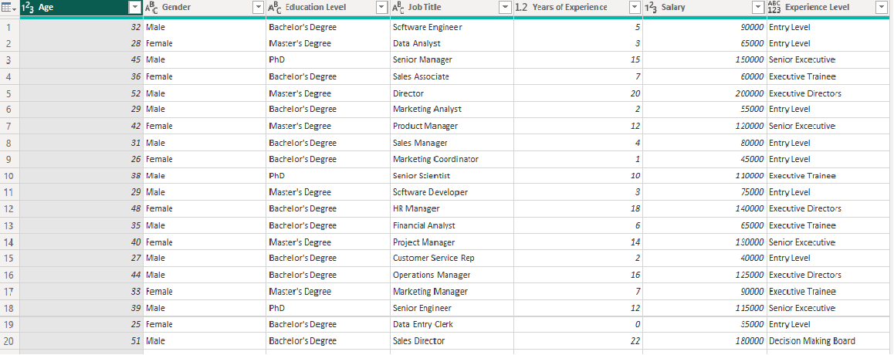

# SALARY ANALYSIS FOR A TECH COMPANY
---

---
## INTRODUCTION
Welcome to **DANANALYTICS**, This reports reveals the salary pattern for a tech company in Nigeria across various department and staff.
**_DISCLAIMER: This analysis does not reflect the true situation of any known company in Nigeria_**

## PROBLEM STATEMENT
**DANANALYTICS** were tasked to dive into their salary data to dsicover:
1. Average salary.
2. Total number of staff.
3. Average year of Experience per department.
4. Any other relevant data driven insight into their salary pattern.

## SKILLS DEMOSTRATED
- Data Cleaning and transformation
- User friendly dashboard design.

## DATA SOURCE
The data used in this analyis was downloaded from Kaggle database

## DATA TRANSFORMATION

Power query was used to clean and transformed thi data. some irrelevant columns were deleted and the years of experience ws regrouped in this format

1. less than or equals 5 years  = Entry Level
2. less than or equals 10 years = Excutive Trainee
3. less than or equals 15 years = Executive Director
4. less than or equals 20 years = Senior Executive
5. less than or equals 25 years = Decision Making Board

see pictures below
Dirty dataset     |     Transformed Datset
:-----------------:|:-----------------:
|

